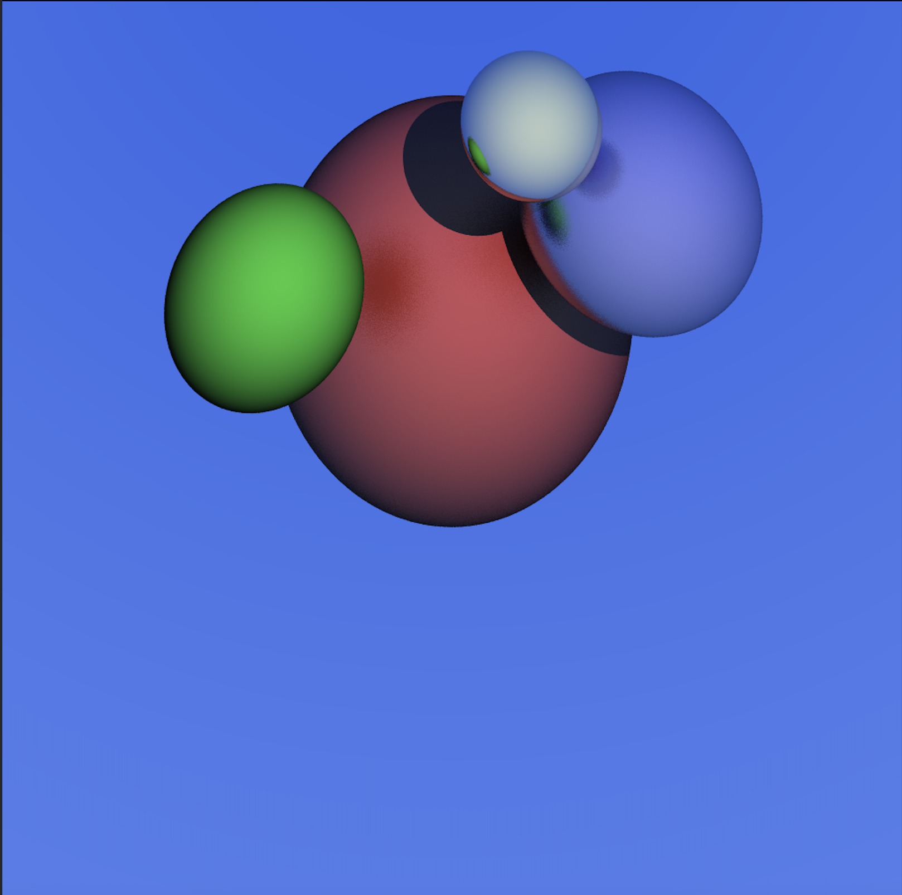

# Ray Tracer

A multithreaded ray tracer built from scratch in C++17. No external libraries — every component including vector math, ray-sphere intersection, shading, shadows, reflections and anti-aliasing was implemented from first principles.



---

## Features

- **Ray-sphere intersection** — quadratic formula based hit detection with correct front/back face handling
- **Lambertian shading** — brightness calculated via dot product of surface normal and light direction
- **Point light source** — with distance-based shadow casting
- **Hard and soft shadows** — shadow rays with surface offset to prevent self-intersection
- **Specular reflections** — recursive ray bouncing with configurable depth limit
- **Roughness** — physically-based roughness model using random unit sphere sampling to scatter reflected rays
- **Anti-aliasing** — stratified sampling with configurable samples per pixel and random sub-pixel offsets
- **Multithreaded rendering** — image split into horizontal bands processed in parallel across CPU cores
- **Command line interface** — configurable resolution, samples and output file

---

## Build

```bash
make
```

Requires clang++ with C++17 support.

---

## Usage

```bash
./build/main [options]
```

### Options

| Flag | Default | Description |
|------|---------|-------------|
| `--width` | 1024 | Image width in pixels |
| `--height` | 1024 | Image height in pixels |
| `--samples` | 16 | Anti-aliasing samples per pixel |
| `--output` | image.ppm | Output file path |

### Examples

```bash
# Default render (1024x1024, 16 samples)
./build/main

# High quality render
./build/main --width 1920 --height 1080 --samples 64 --output render.ppm

# Quick preview
./build/main --width 256 --height 256 --samples 4
```

---

## Performance

All benchmarks run on Apple M-series (10 logical cores), 1024x1024, 16 samples per pixel.

| Configuration | Render Time | Speedup |
|---|---|---|
| Single threaded | 16,638ms | 1x |
| 10 threads (`std::thread`) | 4,303ms | 3.8x |
| 10 threads + `-O2` | 1,421ms | **11.7x** |

Multithreading was implemented by splitting the image into horizontal bands — one per CPU core — processed simultaneously with no locking required since each thread writes to independent regions of a shared pixel buffer. An `std::atomic` counter tracks progress safely across threads.

---

## Architecture

```
├── include/
│   ├── Camera.h          # Ray generation per pixel
│   ├── HitRecord.h       # Hit data struct (t value, normal, hit point, material)
│   ├── Materials.h       # Material properties (colour, reflectivity, roughness)
│   ├── Ray.h             # Ray representation (origin + direction)
│   ├── Renderer.h        # Render loop, multithreading, anti-aliasing
│   ├── Scene.h           # Scene graph, closest hit detection
│   ├── Sphere.h          # Ray-sphere intersection (quadratic formula)
│   └── Vec3.h            # 3D vector math (dot product, reflection, normalise)
├── src/
│   ├── main.cpp          # Entry point, scene setup, CLI parsing
│   ├── Camera.cpp
│   ├── Materials.cpp
│   ├── Ray.cpp
│   ├── Renderer.cpp
│   ├── Scene.cpp
│   ├── Sphere.cpp
│   └── Vec3.cpp
└── makefile
```

---

## Technical Details

### Ray-Sphere Intersection

A ray is defined as `P(t) = origin + t × direction`. A point is on a sphere if `(P - C)² = r²`. Substituting the ray equation into the sphere equation yields a quadratic in `t`:

```
t²(d·d) + 2t(oc·d) + (oc·oc) - r² = 0
```

The discriminant determines whether the ray hits (positive), grazes (zero) or misses (negative) the sphere. The smallest positive `t` value gives the closest intersection point.

### Reflection

Reflected ray direction calculated using:

```
reflected = D - N × 2 × (D · N)
```

Where `D` is the incoming ray direction and `N` is the surface normal. Roughness adds a scaled random vector sampled from a unit sphere, scattering the reflected ray to simulate non-mirror surfaces.

### Multithreading

The image is divided into `N` horizontal bands (one per logical CPU core). Each band is rendered by an independent `std::thread` writing to its own rows of a shared pixel buffer — no mutex required for rendering. A `std::atomic<int>` counter tracks completed pixels for the progress indicator.

---
